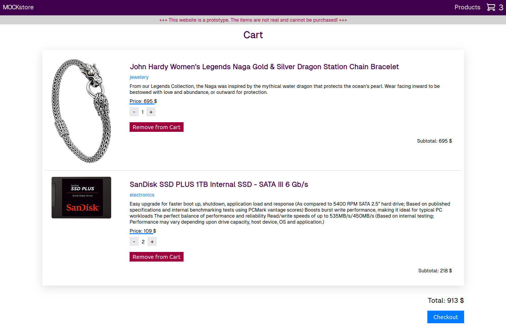

# Online store mock project

This project builds a prototype online store with fake products and a shopping cart. It's a React Single Page Application querying the [Fake Store API](https://fakestoreapi.com/).

## Features

- Browse Products and add them to your shopping cart
- Manage the shopping cart and add or remove items

## Planned Features

- Add filter options to display a subset of products
- Persist the shopping cart with localStorage
- Add some featured products to the Homepage
- Add configuration options for the user (like watch lists and dark mode) and persist them with localStorage

## How to run

The website can be run with npm scripts from the project root directory. The scripts execute Webpack or Webpack DevServer for bundling and development. Jest is used for testing. See `package.json` for details.

### Prerequisites

Node.js and npm (Node Package Manager) have to be installed (I used Node.js 20).

For Windows or Mac visit https://nodejs.org/en and follow the instructions.

For Linux you can use nvm (Node Version Manager, https://github.com/nvm-sh/nvm) to install and manage Node and npm versions.

When using the project for the first time you have to run `npm install` from the project root directory to install dependencies which are defined in the package.json.

### Scripts

For development execute:

    npm run dev

To build the website for production execute:

    npm run build

Tests are written with Jest and can be run with:

    npm run test

## Tools

Webpack 5 is used for processing the source code and the assets (See `webpack.config.js`). It uses Babel for transpiling the JS. The output directory is `dist`. HTMLWebpackPlugin generates `dist/index.html` based on the template in `src/index.html` and injects the bundled JS. Images are processed with Webpack 5 Asset Modules. CSS is processed with css-loader and style-loader plugins.

## Support

If you are having issues, please let me know via the contacts on [my website](https://sjohannknecht.de).

## License

The project is licensed under the ISC license.
